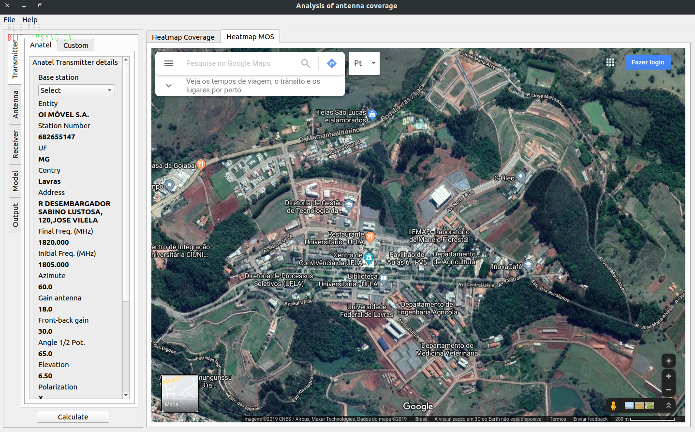

# Analysis of allocation of antenna coverage

### Dependencies for development

###### Linux dependencies
```shell script
sudo apt update
sudo apt install -y build-essential \
                 software-properties-common \
                 python3-pip \
                 libpython3-dev \
                 libpython3-all-dev \
                 python3-distutils
```

###### pcre dependency
```shell script
wget https://ftp.pcre.org/pub/pcre/pcre-8.43.tar.bz2
tar -xvf pcre-8.43.tar.bz2
cd pcre-8.43/
./configure --prefix=/usr                     \
            --docdir=/usr/share/doc/pcre-8.43 \
            --enable-unicode-properties       \
            --enable-pcre16                   \
            --enable-pcre32                   \
            --enable-pcregrep-libz            \
            --enable-pcregrep-libbz2          \
            --enable-pcretest-libreadline     \
            --disable-static
make
make install
mv -v /usr/lib/libpcre.so.* /lib
ln -sfv ../../lib/$(readlink /usr/lib/libpcre.so) /usr/lib/libpcre.so
```

###### swig dependency
```shell script
wget https://ufpr.dl.sourceforge.net/project/swig/swig/swig-4.0.1/swig-4.0.1.tar.gz
tar -xvf swig-4.0.1.tar.gz
cd swig-4.0.1
./autogen.sh
./configure
make
make install

# To check the build, run the tests:
make check-python-examples
```

### Create environment and install python dependencies

```shell script
pip3 install virtualenv
virtualenv venv
source venv/bin/activate
pip install -r requirements.txt
``` 

Fist preview of software:

