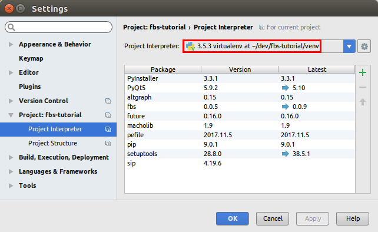
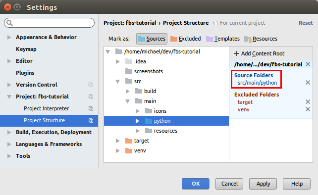
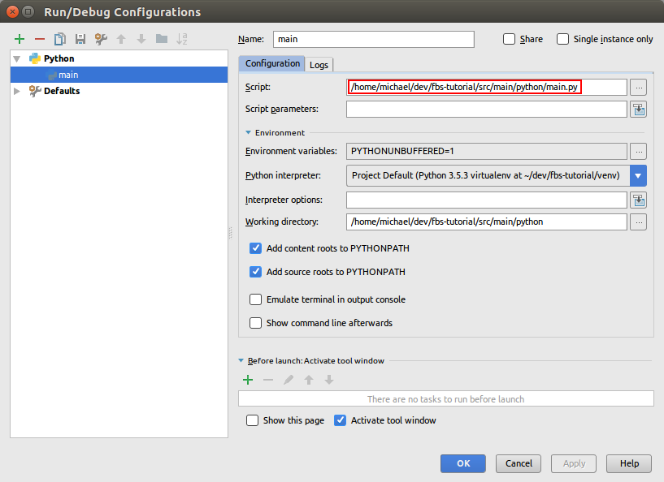

# USING IN IDE

The command fbs run is great to quickly run your app. Many people however prefer working in an IDE such as PyCharm. It especially simplifies debugging.

To run an fbs app from other environments (such as an IDE, or the command line), you simply

- need the virtual environment to be active,
- have src/main/python on your PYTHONPATH and
- run src/main/python/main.py.

So for example on Mac and Linux, you can also run your app from the command line via

PYTHONPATH=src/main/python python src/main/python/main.py
(assuming the virtual environment is active).

Here are screenshots of how PyCharm can be configured for this:

